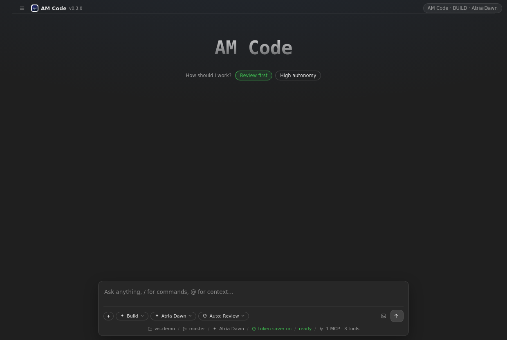
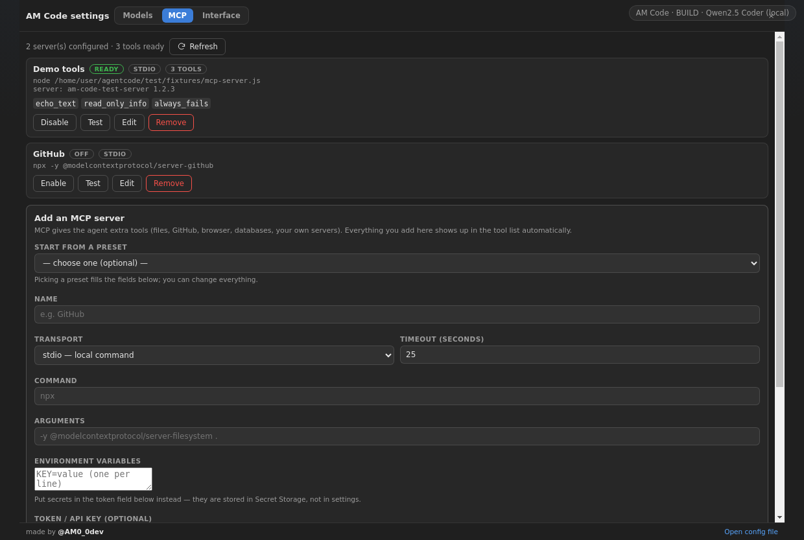
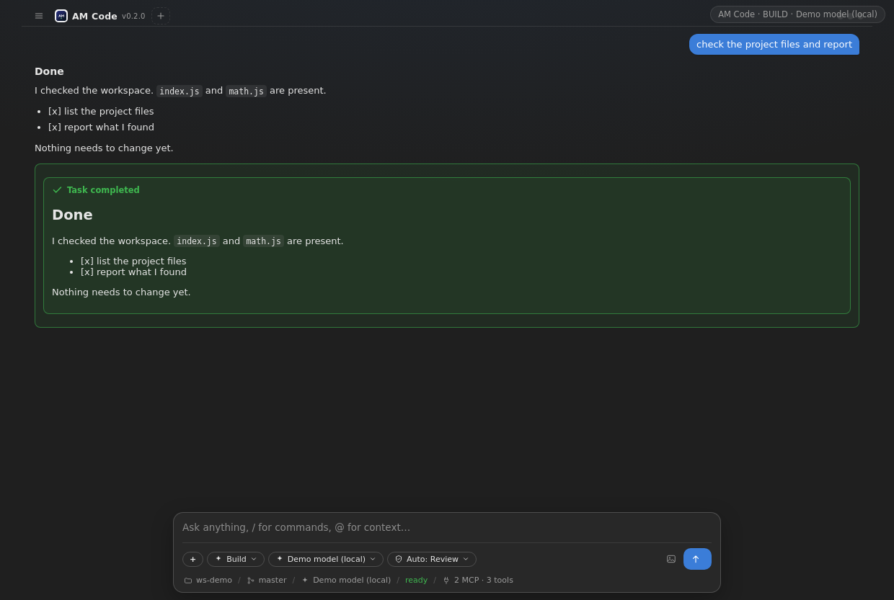

# AM Code Desktop — نسخهٔ ویندوز (و لینوکس/مک)

<p align="center">
  
</p>

همان ایجنت، همان مدل‌ها، همان MCP — این‌بار در یک پنجرهٔ مستقل و تمام‌عرض به سبک OpenCode، بدون
نیاز به VS Code. کد دسکتاپ در پوشهٔ **`desktop/`** است و «مغز» را از خود اکستنشن قرض می‌گیرد
(فایل `vscode` را به یک شیم نگاشت می‌کند)، پس هر قابلیتی که به اکستنشن اضافه شود، خودبه‌خود اینجا هم هست.

## ۰) نصب آماده (فایل ساخته‌شده)

فایل نصبی از قبل ساخته شده و در ریشهٔ پروژه است:

```
AM-Code-Setup-0.4.0.exe        ← همین را روی ویندوز اجرا کن (نصب برای کاربر جاری، بدون ادمین)
```

مسیر نصب پیش‌فرض: `%LOCALAPPDATA%\Programs\AM Code\AM Code.exe`
(میان‌بر دسکتاپ و منوی استارت هم ساخته می‌شود؛ حذف برنامه از «Apps & features» یا
`Uninstall AM Code.exe` ممکن است.)

هشدار هوشمند ویندوز: چون فایل امضای تجاری (Code Signing) ندارد، ممکن است SmartScreen پیام بدهد →
**More info → Run anyway**.

---

## ۰.۵) همه‌چیز داخل خود برنامه

در نسخهٔ دسکتاپ **هیچ پنجرهٔ جداگانه‌ای** برای سؤال‌ها باز نمی‌شود:

- افزودن مدل → صفحهٔ **Models** داخل خود برنامه باز می‌شود
- کلید API، انتخاب نوع مدل، پرسش‌ها → کارت داخلی بالای کامپوزر
- تنظیمات، توکن‌سیور و درباره → همان صفحه‌های داخل برنامه (منوی File/Agent)
- پنجره همیشه در **تسک‌بار** دیده می‌شود و اندازه/جای پنجره یادش می‌ماند
- وقتی برنامه را می‌بندی، **همهٔ پروسه‌های پس‌زمینه** (سرورهای MCP و دستورها) کشته می‌شوند؛
  دیگر چیزی در Task Manager نمی‌ماند

## ۱) سریع‌ترین راه: بگذار GitHub برایت بسازد

فایل نصب ویندوز باید **روی ویندوز** کامپایل شود؛ راحت‌ترین راه این است:

1. پروژه را روی گیت‌هاب بگذار (فایل `am-code-github.zip` را آپلود کن — پوشهٔ `desktop/` داخلش هست)
2. تب **Actions** → ورک‌فلو **AM Code Desktop** → دکمهٔ **Run workflow**
3. بعد از چند دقیقه، در پایین همان صفحه سه Artifact آماده است:
   - `AM-Code-Desktop-Windows` → فایل `AM-Code-Setup-0.2.0.exe`
   - `AM-Code-Desktop-Linux` → فایل `AM-Code-0.2.0.AppImage`
   - `AM-Code-Desktop-macOS` → فایل `.dmg`

اگر با تگ نسخه پوش کنی (`npm version patch && git push --follow-tags`)، همین فایل‌ها به
**GitHub Release** هم ضمیمه می‌شوند و لینک دانلود مستقیم می‌گیری.

## ۲) ساخت روی کامپیوتر خودت (ویندوز)

پیش‌نیاز: [Node.js 20](https://nodejs.org) و Git.

```powershell
git clone https://github.com/<USER>/am-code.git
cd am-code\desktop
npm install
npm run dist:win
```

خروجی در پوشهٔ `desktop\release\`:

| فایل | چیست |
| --- | --- |
| `AM-Code-Setup-0.4.0.exe` | نصب‌کننده (NSIS) — بدون نیاز به دسترسی ادمین |
| `AM-Code-Portable-0.4.0.exe` | نسخهٔ پرتابل؛ بدون نصب اجرا می‌شود |

> اگر SmartScreen اخطار داد (چون فایل امضای تجاری ندارد): **More info → Run anyway**.

برای اجرای بدون ساخت فایل نصبی (حالت توسعه):

```powershell
npm start          # ساخت + اجرا
npm run watch      # ساخت خودکار هنگام ویرایش
```

## ۳) داخل برنامه

| کار | از کجا |
| --- | --- |
| انتخاب پوشهٔ پروژه | منوی **File → Open Folder…** (یا `AM Code.exe D:\projects\app`) |
| افزودن مدل (Base URL + Model ID) | کامپوزر → **＋ → Model…** یا منوی **Agent → Add Model…** |
| سرورهای MCP | کامپوزر → **＋ → MCP server…** یا `Ctrl+Alt+M` |
| چیدمان پنجره‌کامل / کنار | **View → Full window / Side panel** یا *Settings → Interface* |
| ترمینال دستورات ایجنت | پنجرهٔ جداگانه‌ای که فقط دستورهای ایجنت را اجرا می‌کند |
| تنظیمات / کلیدها / لاگ | منوی File → Open Settings File / Open Log File |

مسیرها در ویندوز:

```
%APPDATA%\AM Code\settings.json     ← تنظیمات (مدل‌ها، MCP، چیدمان)
%APPDATA%\AM Code\secrets.json      ← کلیدهای API، رمزنگاری‌شده با کلید ویندوز (safeStorage)
%APPDATA%\AM Code\am-code.log       ← لاگ کامل
```

## ۴) نمونه‌ها

<p align="center">
  
  
</p>

## ۵) چه چیزی شبیه VS Code است و چه چیزی نیست؟

| قابلیت | VS Code | دسکتاپ |
| --- | --- | --- |
| ایجنت، چک‌لیست، Plan/Build، Review/High | ✅ | ✅ (مثل هم) |
| مدل‌ها با Base URL + Model ID، تست اتصال | ✅ | ✅ |
| MCP (stdio + HTTP/SSE) | ✅ | ✅ |
| دیف‌بینی قبل از تأیید | دیف بومی VS Code | پنجرهٔ Compare داخلی برنامه |
| خطاهای LSP | ✅ | ❌ (به‌جایش خروجی دستورها) |
| ترمینال | ترمینال بومی VS Code | پنجرهٔ ترمینال داخلی |
| انتخاب ادیتور/سلکشن به‌عنوان کانتکست | ✅ | ❌ (فایل‌ها را ایجنت خودش می‌خواند) |

## ۶) عیب‌یابی

| مشکل | راه‌حل |
| --- | --- |
| صفحه سفید/خالی | منوی File → Open Log File را ببین؛ معمولاً یک سرور MCP خراب است → از صفحهٔ MCP آن را Disable کن |
| ابزارهای `npx` کار نمی‌کنند | Node.js نصب نیست؛ در cmd دستور `node -v` را تست کن |
| پنجرهٔ خیلی کوچک/بزرگ | **View → Full window / Side panel** یا زوم با `Ctrl + / Ctrl −` |
| کلید API پاک شده | فایل `secrets.json` با کلید ویندوز رمز می‌شود؛ اگر Windows Hello عوض شده باشد باید کلید را دوباره وارد کنی |
| بیلد روی ویندوز خطا داد | `npm cache clean --force` و بعد `npm install` مجدد؛ مطمئن شو مسیر پروژه حاوی فاصله یا کاراکتر فارسی نیست |
