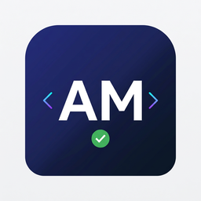
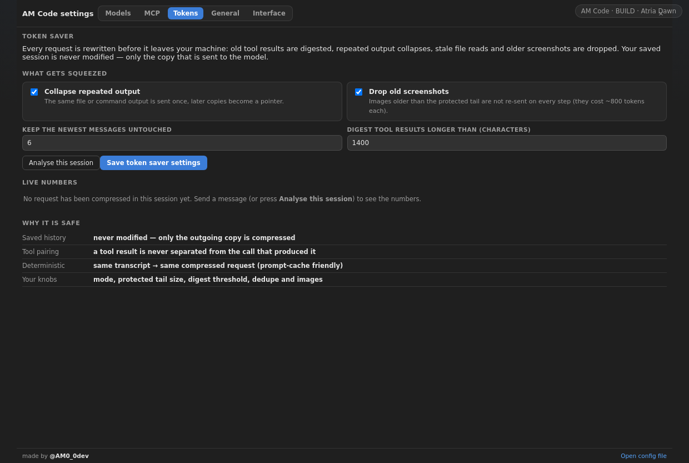
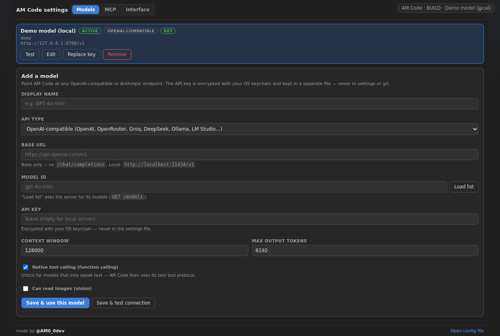

<div align="center">



# AM Code

**دستیار کدنویسی ایجنت — با مدل‌های خودت. صورتحساب خودت. بدون سقف.**

[](https://github.com/Araz0-0dev/am-code/actions/workflows/ci.yml)
[](https://github.com/Araz0-0dev/am-code/releases/latest)
[](test)
[](LICENSE)
[](https://code.visualstudio.com/)
[](https://t.me/AM0_0dev)

[نصب سریع](#نصب) · [توکن‌سیور](#چرا-am-code-پولتو-نگه-می‌دارد) · [اسکرین‌شات‌ها](#اسکرینشاتها) · [English](README.en.md)


</div>

---

## ۳۰ ثانیه‌ای بفهم چه چیزی است

یک ایجنت واقعی داخل VS Code و به‌شکل یک **برنامهٔ مستقل ویندوز/لینوکس/مک**:

> **هر مدلی را با `Base URL` + `Model ID` وصل می‌کنی — همان لحظه ایجنت کار می‌کند.**
> OpenAI، OpenRouter، Groq، DeepSeek، Together، Mistral، xAI، Qwen، vLLM، LM Studio، Ollama
> و هر سرور سازگار با OpenAI… و API نیتیو Anthropic.

مثل Claude Code و OpenCode کار می‌کند — **حالت Plan/Build**، **چک‌لیست خودساخته با تیک‌خوردن زنده**،
ویرایش فایل، اجرای ترمینال، خواندن خطاهای LSP، ساب‌ایجنت تحقیق، **MCP** — ولی هیچ اشتراک ماهانه‌ای
لازم نیست، هیچ مدلی به تو تحمیل نمی‌شود و همه‌چیز **فارسی** هم کار می‌کند.

---

## چرا AM Code پول‌تو نگه می‌دارد؟ 💸

**توکن‌سیور** — چیزی که فقط AM Code دارد:

هر درخواست، **قبل از اینکه از کامپیوترت بیرون برود**، فشرده می‌شود. پول تو را معمولاً حرف‌های خودت
نمی‌سوزاند؛ چیزهایی می‌سوزاند که دور آن‌ها جمع می‌شوند و **در هر گام دوباره فرستاده می‌شوند**:
خروجی فایل‌ها، لاگ دستورها، پاسخ ابزارهای MCP و اسکرین‌شات‌ها.

<div align="center">

```
before  28,061 tokens   →   after  9,689 tokens       ۶۵٪ کمتر، همان نتیجه
```

<sub>اندازه‌گیری واقعی روی یک سشن کاری؛ خروجی: `4 repeated tool outputs collapsed to a pointer`</sub>

</div>

| تکنیک | چه کاری می‌کند |
| --- | --- |
| 🧠 **خلاصه‌سازی هوشمند ابزار** | خروجی‌های بزرگ قدیمی → سر + ته، با علامت صادقانهٔ «n خط حذف شد توسط AM Code» |
| 🔁 **حذف تکرار** | همان فایل/دستور که چند بار خوانده شده → یک خط اشاره به نسخهٔ جدیدتر |
| 🗂️ **کنار‌گذاشتن نسخهٔ قدیمی** | فایلی که بعداً دوباره خوانده شود، نسخهٔ قدیمی‌اش از درخواست حذف می‌شود |
| 🖼️ **حذف اسکرین‌شات‌های قدیمی** | هر تصویر حدوداً ۸۰۰ توکن است؛ تصاویر قدیمی دیگر فرستاده نمی‌شوند |
| 🧹 **پاک‌سازی نویز** | رنگ‌های ANSI ترمینال، `\r` و خطوط خالی پشت‌سرهم |

**امنیت و صحت:**

- ✅ **سشن ذخیره‌شده دست‌نخورده می‌ماند** — فقط کپیِ ارسالی فشرده می‌شود؛ تاریخچهٔ تو کامل می‌ماند.
- ✅ هیچ `tool result`ی از فراخوانی متناظرش جدا نمی‌شود → APIهای سخت‌گیر (Anthropic، OpenAI) خطا نمی‌دهند.
- ✅ نتیجه **قطعی و تکرارپذیر** است → **prompt cache** سرویس‌دهنده خراب نمی‌شود (هزینه‌ات کمتر هم می‌شود).
- ✅ سه حالت: **Off / Balanced / Aggressive** — و دکمهٔ *Analyse this session* که قبل از هر تصمیمی، عدد واقعی را نشانت می‌دهد.

<div align="center">
<br>
<sub>صفحهٔ Tokens: حالت، تنظیم دقیق، «Analyse this session» و آمار زندهٔ صرفه‌جویی</sub>
</div>

---

## AM Code چه دارد؟

| | AM Code | Claude Code | OpenCode |
| --- | :-: | :-: | :-: |
| مدل دلخواه با `Base URL` + `Model ID` | ✅ نامحدود | ❌ فقط Anthropic | ✅ |
| فشرده‌سازی هر درخواست (**توکن‌سیور**) | ✅ | ❌ (فقط `/compact` دستی) | ❌ |
| برنامهٔ دسکتاپ ویندوز (فایل نصبی) | ✅ | ❌ (ترمینال) | ⚠️ بتا |
| همهٔ تنظیمات داخل خود UI (بدون فایل کانفیگ) | ✅ ۵ صفحه | ❌ | ⚠️ کانفیگ فایل |
| **MCP** با صفحهٔ گرافیکی (stdio + HTTP/SSE) | ✅ | ✅ CLI | ✅ کانفیگ |
| چک‌لیست خودساخته با تیک زنده | ✅ | ✅ | ✅ |
| فارسی (رابط + پاسخ‌ها) | ✅ | ❌ | ❌ |
| رایگان و اوپن‌سورس (MIT) | ✅ | ❌ | ✅ |

### فهرست امکانات

- 🧭 **Plan / Build** — حالت Plan فقط می‌خواند و برنامه پیشنهاد می‌دهد؛ Build می‌سازد.
- ✅ **چک‌لیست خودساخته** — ایجنت خودش تسک‌ها را می‌نویسد و همان‌طور که جلو می‌رود، تیک می‌زند.
- 🗂️ **ویرایش فایل با کارت تأیید + دیف واقعی VS Code** (Approve / Always allow / Reject).
- 🖥️ **ترمینال** — اجرای دستور با تایم‌اوت، خروجی زنده و کارت تأیید جدا.
- 🔎 **ابزارها** — خواندن/نوشتن/جست‌وجوی فایل، grep، glob، LSP (خطاها و تعریف‌ها)، fetch وب.
- 🧑‍🔬 **ساب‌ایجنت تحقیق** — یک هلپر با کانتکست جدا که فقط خلاصه برمی‌گرداند.
- 🧠 **حافظهٔ پروژه** — دستورات و قواعد خودت که همیشه در پرامپت می‌آیند.
- 🗃️ **سشن‌ها** — چند سشن هم‌زمان با تب؛ سشن‌ها ذخیره و بازیابی می‌شوند.
- 🛑 **ضدسوزاندن توکن** — «سلام» = یک پاسخ و تمام (نه ۲۰ گام)؛ در حلقه‌های بی‌فایده هشدار و بعد توقف.
- ⚙️ **۵ صفحهٔ تنظیمات در خود پنل** — Models · MCP · Tokens · General · Interface.

---

<div align="center">
<br>
<sub>اجرای واقعی: چک‌لیست، فراخوانی ابزار MCP و کارت پایان کار</sub>
</div>

## اسکرین‌شات‌ها

| صفحهٔ مدل‌ها | صفحهٔ MCP |
| :-: | :-: |
|  |  |

چیدمان‌ها: **Panel** (کنار کد، داخل سایدبار) و **Ultra** (کل پنجره، مثل OpenCode) — از `Settings → Interface`.

---

## نصب

### ۱) برنامهٔ دسکتاپ — فایل آماده، بدون هیچ تنظیمی

| سیستم | دانلود مستقیم | نکته |
| --- | --- | --- |
| 🪟 **ویندوز ۱۰/۱۱** | [**AM-Code-Setup-0.3.0.exe**](https://github.com/Araz0-0dev/am-code/releases/latest/download/AM-Code-Setup-0.3.0.exe) | نصب برای کاربر جاری، **بدون دسترسی ادمین**، میان‌بر دسکتاپ و منوی استارت |
| 🐧 **لینوکس** | [AM-Code-0.3.0.AppImage](https://github.com/Araz0-0dev/am-code/releases/latest/download/AM-Code-0.3.0.AppImage) | `chmod +x` و بعد اجرا |
| 🍎 **مک (Apple Silicon)** | [AM-Code-0.3.0-arm64.dmg](https://github.com/Araz0-0dev/am-code/releases/latest/download/AM-Code-0.3.0-arm64.dmg) | باز کن و به Applications بکش |

> روی ویندوز اگر SmartScreen هشدار داد (چون امضای تجاری ندارد): **More info → Run anyway**.

🎨 می‌خواهی رابط را قبل از نصب ببینی؟ [**panel-preview.html**](https://github.com/Araz0-0dev/am-code/releases/latest/download/panel-preview.html) را در مرورگر باز کن.

### ۲) VS Code — افزونه

[**دانلود `am-code-0.3.0.vsix`**](https://github.com/Araz0-0dev/am-code/releases/latest/download/am-code-0.3.0.vsix) و بعد:

```bash
code --install-extension am-code-0.3.0.vsix
```

یا در VS Code: **Extensions → ⋯ → Install from VSIX…**

### ۳) ساخت از سورس

```bash
git clone https://github.com/Araz0-0dev/am-code.git
cd am-code
npm install
npm test          # ۵۷ تست: موتور، پرووایدرها، MCP، توکن‌سیور، فعال‌سازی، پنل
npm run build
npm run package   # → am-code-0.3.0.vsix
```

دسکتاپ:

```bash
cd desktop
npm install
npm start         # اجرای برنامه
npm run dist:win  # → release/AM-Code-Setup-0.3.0.exe
```

---

## شروع کار

1. پنل AM Code را باز کن (آیکن AM در نوار کنار، یا `Ctrl+Shift+P` → **AM Code: Open Chat**).
2. چرخ‌دنده ⚙️ → **Models** → *Add model*:
   - **Base URL**: مثل `https://api.openai.com/v1` یا `https://api.together.xyz/v1` یا `http://localhost:11434/v1`
   - **Model ID**: مثل `gpt-4o-mini`، `deepseek-chat`، `qwen2.5-coder:32b`
   - **API Key** (اگر لازم است) → *Save & test connection* ✅
3. بنویس چه می‌خواهی. تمام. ایجنت خودش پلن می‌سازد، تیک می‌زند و کار می‌کند.

**مدل‌های پیشنهادی برای شروع ارزان:** `deepseek-chat` · `gpt-4o-mini` · `claude-haiku` ·
هر مدل روی OpenRouter · هر مدل لوکال روی Ollama/LM Studio (بدون هیچ هزینه‌ای).

---

## MCP — ابزارهای اضافه، همه گرافیکی

⚙️ → **MCP** → پریست‌های آماده (Filesystem، GitHub، Fetch، Memory، Playwright، SQLite، HTTP راه‌دور):

- دو نوع اتصال: **stdio** (دستور) و **HTTP/SSE**
- ویرایشگر `KEY=VALUE` برای env و `Header: value` برای هدرها
- فیلتر ابزار (`read_*`)، فعال/غیرفعال، **تأیید خودکار** برای هر سرور
- دکمهٔ **Test**: نام و نسخهٔ سرور و فهرست ابزارهایش را نشان می‌دهد
- توکن‌ها در **Secret Storage** می‌مانند و فقط موقع اتصال تزریق می‌شوند

دستورها: **AM Code: MCP Servers…** (`Ctrl+Alt+M`) و **AM Code: Refresh MCP Servers**.

---

## چطور کار می‌کند؟

```
تو: «این باگ را پیدا کن و درست کن»
 ├─ ⏺ پلن: [1] خواندن کد مرتبط  [2] پیدا کردن علت  [3] اصلاح  [4] تست
 ├─ ✔️ ۱. خواندن کد
 ├─ ✔️ ۲. علت پیدا شد (فایل: line)
 ├─ 🔧 کارت تأیید: ویرایش main.ts (+۴/-۲)   → Approve
 ├─ ✔️ ۳. اصلاح شد
 ├─ 🖥️ اجرای تست‌ها → سبز
 └─ 📦 گزارش پایانی
```

### ضدسوزاندن توکن

- «سلام» یا یک سؤال ساده = **یک درخواست، صفر ابزار** و تمام.
- حلقه‌ای که فقط می‌خواند → هشدار بعد از ۳ گام، توقف بعد از ۸ گام.
- **بودجهٔ نرم گام** (پیش‌فرض ۱۵): ایجنت را می‌فرستد سراغ جمع‌بندی و گفتن نتیجه.
- هر ویرایش واقعی، شمارندهٔ حلقه را صفر می‌کند.

---

## تنظیمات

همه از داخل پنل قابل تغییرند (⚙️ → **General**)؛ در فایل تنظیمات هم `agentcode.*` هستند:

| کلید | پیش‌فرض | توضیح |
| --- | --- | --- |
| `tokenSaver` | `balanced` | فشرده‌سازی هر درخواست: `off` / `balanced` / `aggressive` |
| `tokenSaverKeepRecent` | `6` | چند پیام آخر دست‌نخورده بماند |
| `tokenSaverMaxToolChars` | `1400` | خروجی بلندتر از این، خلاصه (سر+ته) می‌شود |
| `tokenSaverDedupe` · `tokenSaverDropImages` | `true` | حذف خروجی تکراری · حذف اسکرین‌شات‌های قدیمی |
| `mode` | `build` | `build` / `plan` |
| `workMode` | `review` | `review` (تأیید قبل از تغییر) / `autonomy` |
| `mcpServers` | `[]` | سرورهای MCP |
| `maxSteps` · `softStepBudget` | `40` · `15` | سقف گام · بودجهٔ نرم |
| `autoApproveRead/Write/Commands` | `true/false/false` | دسترسی خودکار |
| `interfaceLayout` | `auto` | `panel` / `ultra` / `auto` |
| `responseLanguage` | `auto` | `auto` / `fa` / `en` |
| `customInstructions` | `` | قواعد تیم و پروژه |

<details>
<summary>بقیهٔ کلیدها</summary>

`toolCallMode`, `strictChecklist`, `alwaysPlan`, `subagents`, `enableWebTools`,
`includeOpenFileContext`, `includeDiagnostics`, `showReasoning`, `approvalStyle`,
`useIntegratedTerminal`, `commandTimeoutMs`, `thinkingBudgetHint`, `maxTokens`, `temperature`

</details>

---

## تست‌ها

```bash
npm test
```

```
11/11 core tests passed          موتور ایجنت + محافظ‌ها
 4/4  provider tests passed      درخواست/استریم/خطای پرووایدرها
10/10 MCP tests passed           سرور stdio و HTTP واقعی
11/11 token saver tests passed   فشرده‌سازی + اثبات کوچک‌شدن پیلود روی سیم
 5/5  activation tests passed    فعال‌سازی اکستنشن
15/15 webview tests passed       پنل (Models · MCP · Tokens · General · Interface)
```

---

## ساختار پروژه

```
src/core/        موتور: حلقهٔ ایجنت، ابزارها، پرامپت‌ها، پرووایدرها، MCP، توکن‌سیور
src/host/        لایهٔ VS Code: کانفیگ، سکرت‌ها، ترمینال، دیف، تنظیمات
src/ui/          پنل وب (HTML/CSS/JS) + پروتکل پیام‌ها
desktop/         برنامهٔ Electron (ویندوز/لینوکس/مک) — همان موتور، بدون تغییر
test/            تست‌ها (node:test) + سرور MCP تستی
```

---

## نقشهٔ راه

- [ ] مدل‌های embedding برای ایندکس معنایی کد
- [ ] حالت «تیم»: چند مدل، هر کدام برای یک نوع کار (ارزان برای خواندن، قوی برای طراحی)
- [ ] گیت‌هاب اکشن برای ساخت خودکار نسخهٔ دسکتاپ روی هر Release ✅ (ساخته شده)
- [ ] مارکت‌پلیس VS Code
- [ ] ترجمهٔ رابط به عربی و ترکی

---

## سازنده

ساختهٔ **AM** — [@AM0_0dev](https://t.me/AM0_0dev)

اگر استفاده کردی و به‌کارت آمد، یک ⭐ ستاره بده؛ اگر ایرادی دیدی، Issue باز کن.
خوشحال می‌شوم مدل‌ها و تجربه‌هایت را در تلگرام برایم بنویسی.

## مجوز

[MIT](LICENSE) — آزاد برای استفاده، تغییر و انتشار تجاری.
